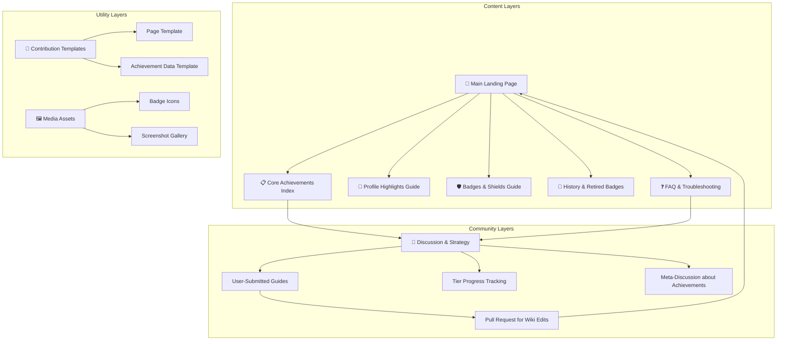

# 🧠 GitHub Achievements Wiki | The Central Knowledge Hub

### **The Definitive, Community-Powered Encyclopedia for GitHub's Achievement System**

Welcome to the central nervous system of GitHub gamification. This is not just another list of badges—it's a living, breathing **knowledge repository** designed to document, explain, and celebrate every facet of GitHub Achievements.

## 📖 What is This Wiki?

This repository hosts a **GitHub Wiki**—a feature for sharing detailed, long-form information about a project. Unlike the main repository's code, the Wiki exists as a separate, linked space dedicated entirely to documentation.

This Wiki serves as the **comprehensive, canonical reference** for GitHub's Achievement and profile badge system. It is built and maintained by the community, for the community.

### 🎯 Core Mission
- **Document** every Achievement, badge, and highlight with precise criteria.
- **Educate** users on how to legitimately unlock milestones.
- **Clarify** the differences between Achievements, Highlights, and custom badges.
- **Archive** the history of the system, including retired badges.
- **Foster** a collaborative space for sharing tips and strategies.

## 🏗️ Wiki Architecture & Content Map

The Wiki is structured into logical sections for easy navigation. The diagram below illustrates how the content is organized and how different users might interact with it:

*Diagrams can be created directly in Markdown on GitHub using Mermaid syntax.*

## 🧩 What You'll Find in the Wiki

### 1. **The Master Achievement Index**
The heart of the Wiki. Each Achievement has its own detailed page or a comprehensive table entry, including:
- **Official Name & Emoji**: (e.g., ⭐ Starstruck, 🦈 Pull Shark).
- **Earning Criteria**: Step-by-step, verified instructions. For example, **Pull Shark** is earned by opening pull requests that get merged, while **Galaxy Brain** requires having your replies accepted as answers in Discussions.
- **Tier System**: Many badges have multiple levels (Base, Bronze, Silver, Gold).
- **Visual Examples**: Screenshots of the badge on a profile.
- **Pro Tips & Common Pitfalls**: Community-vetted advice.

### 2. **Guide to Profile "Highlights"**
Clarifies badges that reflect status or program membership, which are distinct from earned Achievements. These include:
- **GitHub Pro**: For active Pro subscribers.
- **Security Bug Bounty Hunter**: For reporting security vulnerabilities.
- **GitHub Campus Expert**: For student leaders in the program.
- **Developer Program Member**.
- **Security Advisory Credit**.

### 3. **Understanding Badges (Shields) in READMEs**
A dedicated section explaining **GitHub Markdown badges**—the customizable status icons you add to your repository's `README.md` file. This is different from profile Achievements but related in spirit. It covers services like **Shields.io** for showing build status, version, or license.

### 4. **The Historical Archive**
Documents badges that are part of GitHub's history but are no longer earnable:
- **Arctic Code Vault Contributor**: For code included in the 2020 archive snapshot.
- **Mars 2020 Helicopter Contributor**: For contributions to the Ingenuity mission repo.

### 5. **Community FAQ & Troubleshooting**
Answers to common questions compiled from official sources and community experience:
- **"Why hasn't my badge appeared?"** (Common reasons: processing delay, private contributions disabled, work done only in a fork).
- **"Can I hide badges?"** (Yes, in profile settings).
- **"Do private contributions count?"** (Yes, if you enable the setting).

## ✨ How to Use & Navigate the Wiki

1.  **Access the Wiki**: Click on the [`Wiki`](https://github.com/AshrafMorningstar/GitHub-Achievements-Wiki/wiki) tab at the top of this repository's main page.
2.  **Start Reading**: The **Home** page is your table of contents. Use the sidebar to navigate between pages.
3.  **Use Search**: The Wiki has a built-in search function to find specific badges or topics.
4.  **Follow Links**: Extensive internal linking connects related concepts, guides, and discussions.

## 🤝 Contributing to the Wiki

This is a **community-driven** project. Your knowledge is what makes it valuable.

### How to Contribute:
1.  **Edit Existing Pages**: Every Wiki page has an "Edit" button. Click it to improve content, fix typos, or add new information.
2.  **Add New Pages**: Use the "New Page" button to document a badge or topic that's missing.
3.  **Use Templates**: Follow the provided page templates for Achievements and guides to maintain consistency.
4.  **Start Discussions**: Use the Wiki's discussion features or the repository's main "Discussions" tab to propose major changes or clarify ambiguous criteria.

### Contribution Philosophy:
- **Accuracy First**: Prefer official GitHub sources and verifiable personal experience.
- **Clarity is Key**: Write for a beginner-friendly audience. Assume the reader is new to the concept.
- **Be Collaborative**: Respect other editors. Use edit summaries to explain your changes.

## 📊 The Value of a Dedicated Wiki

| Aspect | Regular `README.md` | **GitHub Wiki** |
| :--- | :--- | :--- |
| **Scope** | Single document overview. | **Multi-page, in-depth encyclopedia.** |
| **Maintenance** | Edits require PRs to the main repo. | **Editable directly via the web interface** by collaborators. |
| **Structure** | Linear, limited by length. | **Hierarchical, with a sidebar and easy navigation.** |
| **Focus** | Describes the project's code. | **Dedicated to subject matter documentation.** |

## 🔮 Roadmap & Future Vision

- **Interactive Badge Checklists**: User-maintainable checklists to track personal progress.
- **"Path to Unlock" Guides**: Curated learning paths for specific badge categories.
- **Internationalization**: Translating key pages into multiple languages.
- **API Integration Showcase**: Examples of using the GitHub API to query achievement data.

---

### **Knowledge is the Greatest Achievement of All**

This Wiki transforms collective curiosity into a lasting resource. Whether you're here to **learn** how to get your first **Quickdraw** badge (close an issue/PR within 5 minutes), to **document** a nuanced strategy, or simply to **explore**—you are welcome.

**[Begin Your Exploration Here](https://github.com/AshrafMorningstar/GitHub-Achievements-Wiki/wiki)**

*This Wiki is an independent community project and is not affiliated with GitHub, Inc.*

