# 🏆 GitHub Achievements Wiki

<div align="center">


**The Ultimate Encyclopedia of GitHub Achievements**  
*Your Comprehensive Guide to Mastering GitHub's Recognition System*

[📖 View Wiki](#wiki-navigation) | [🎮 Achievement Tracker](#achievement-tracker) | [📊 Statistics](#statistics) | [🤝 Contribute](#contributing-guide) | [🌟 Star History](#star-history)

</div>

---

## 🌟 Welcome to the GitHub Achievements Universe!

Welcome to the **most comprehensive, detailed, and beautifully organized** resource for GitHub Achievements on the internet! This isn't just another documentation site—it's a **living encyclopedia** that grows with every new GitHub feature, every community discovery, and every achievement unlocked.

> "Transform your GitHub profile from ordinary to extraordinary—one achievement at a time."

---

## 📚 What's Inside?

This wiki is meticulously organized into several comprehensive sections:

### 🏆 **Achievement Catalog**
Complete documentation of every GitHub Achievement with:
- **Official Achievements**: Verified by GitHub
- **Community Discoveries**: User-found achievements
- **Historical Achievements**: Retired/legacy badges
- **Regional Variants**: Geographic-specific achievements
- **Easter Eggs**: Hidden gems and secret achievements

### 🎯 **Guides & Strategies**
Step-by-step tutorials for earning achievements:
- **Beginner-Friendly Guides**: Start your journey
- **Advanced Strategies**: Master-level techniques
- **Time-Saving Tips**: Efficient achievement hunting
- **Troubleshooting**: Common issues and solutions
- **Best Practices**: Do's and don'ts

### 📊 **Analytics & Tracking**
Tools to track your progress:
- **Personal Dashboard**: Track your achievements
- **Global Statistics**: See what others are earning
- **Rarity Index**: How rare is each achievement?
- **Trending Achievements**: What's popular right now?

---

## 🚀 Quick Start

### **For Achievement Hunters**
```bash
# Clone the repository
git clone https://github.com/AshrafMorningstar/GitHub-Achievements-Wiki.git

# Navigate to the guides section
cd GitHub-Achievements-Wiki/guides/quick-start/

# Follow the structured learning path
# 1. Start with "beginner-achievements.md"
# 2. Progress to "intermediate-techniques.md"
# 3. Master "advanced-strategies.md"
```

### **For Contributors**
```bash
# Fork the repository
# Create a new branch
git checkout -b add-new-achievement

# Follow our contribution guidelines
# Submit a pull request
```

---

## 📖 Wiki Navigation

### **Main Sections**

| Section | Description | File Count |
|---------|-------------|------------|
| **📁 achievements/** | Complete achievement database | 150+ |
| **📁 guides/** | Step-by-step tutorials | 45+ |
| **📁 tools/** | Helper scripts and tools | 20+ |
| **📁 community/** | User contributions and stories | 100+ |
| **📁 api/** | API documentation and examples | 15+ |
| **📁 media/** | Images, badges, and visual assets | 200+ |

### **Quick Links**

- **[All Achievements A-Z](achievements/README.md)**
- **[Getting Started Guide](guides/getting-started.md)**
- **[Interactive Tracker](tools/tracker/README.md)**
- **[API Documentation](api/README.md)**
- **[Contribution Guide](CONTRIBUTING.md)**
- **[FAQ](guides/faq.md)**

---

## 🏗 Project Architecture

### **System Overview**


### **Data Flow Diagram**


---

## 📊 Achievement Categories

### **🎯 Core Achievements**
| Category | Achievements | Difficulty | Average Time |
|----------|--------------|------------|--------------|
| **Repository** | 25+ | Easy-Medium | 1-4 hours |
| **Collaboration** | 15+ | Medium | 2-8 hours |
| **Community** | 20+ | Easy-Hard | 1-20 hours |
| **Events** | 10+ | Medium-Hard | 4-48 hours |
| **Special** | 5+ | Very Hard | 24+ hours |

### **🏆 Rarity Tiers**


### **📈 Progress Tracking Matrix**
| Level | Achievements Needed | Badge Unlocked | Profile Effect |
|-------|---------------------|----------------|----------------|
| **Beginner** | 0-5 | 🟢 | Basic glow |
| **Intermediate** | 6-15 | 🔵 | Enhanced border |
| **Advanced** | 16-30 | 🟣 | Animated frame |
| **Expert** | 31-50 | 🟡 | Special effects |
| **Master** | 51-75 | 🟠 | Premium showcase |
| **Grandmaster** | 76+ | 🔴 | Legendary status |

---

## 🔧 Tools & Utilities

### **Achievement Tracker Script**
```python
#!/usr/bin/env python3
"""
GitHub Achievement Progress Tracker
Automatically tracks your achievement progress
"""

import requests
import json
from datetime import datetime

class GitHubAchievementTracker:
    def __init__(self, username):
        self.username = username
        self.base_url = "https://api.github.com"
        self.achievements_db = self.load_achievements_db()
    
    def load_achievements_db(self):
        """Load achievement database from wiki"""
        with open('achievements/database.json', 'r') as f:
            return json.load(f)
    
    def check_achievement(self, achievement_id):
        """Check if user has earned specific achievement"""
        # Implementation logic here
        pass
    
    def generate_report(self):
        """Generate detailed progress report"""
        report = {
            "username": self.username,
            "total_achievements": 0,
            "earned": [],
            "missing": [],
            "completion_percentage": 0,
            "next_recommended": []
        }
        return report
```

### **Browser Extension Features**
```javascript
// Achievement Hunter Browser Extension
class AchievementHunterExtension {
    constructor() {
        this.features = {
            realTimeTracking: true,
            achievementSuggestions: true,
            progressNotifications: true,
            autoGuidance: true,
            communityIntegration: true
        };
    }
    
    // Real-time achievement detection
    detectAchievements() {
        // Monitors GitHub activity
        // Suggests next achievements
        // Provides quick guides
    }
}
```

---

## 📁 Directory Structure

```
GitHub-Achievements-Wiki/
├── 📁 achievements/                    # Main achievement database
│   ├── 📁 official/                   # GitHub official achievements
│   │   ├── 🎯 repository/             # Repo-based achievements
│   │   ├── 👥 collaboration/          # Collaboration achievements
│   │   ├── 🌍 community/              # Community achievements
│   │   ├── 📅 events/                 # Event achievements
│   │   └── ✨ special/                # Special achievements
│   ├── 📁 community/                  # Community discoveries
│   ├── 📁 retired/                    # Retired achievements
│   └── 📁 easter-eggs/                # Hidden achievements
├── 📁 guides/                         # Learning materials
│   ├── 📁 beginner/                   # Beginner guides
│   ├── 📁 intermediate/               # Intermediate guides
│   ├── 📁 advanced/                   # Advanced strategies
│   ├── 📁 troubleshooting/            # Problem solving
│   └── 📁 best-practices/             # Recommended approaches
├── 📁 tools/                          # Helper tools
│   ├── tracker/                       # Progress tracker
│   ├── calculator/                    # Achievement calculator
│   ├── generator/                     # Badge generator
│   └── analyzer/                      # Profile analyzer
├── 📁 api/                            # API documentation
│   ├── endpoints/                     # API endpoints
│   ├── examples/                      # Code examples
│   └── integration/                   # Integration guides
├── 📁 community/                      # Community content
│   ├── showcase/                      # User showcases
│   ├── stories/                       # Success stories
│   └── contributions/                 # Community contributions
├── 📁 media/                          # Visual assets
│   ├── badges/                        # Achievement badges
│   ├── screenshots/                   # Screenshots
│   ├── diagrams/                      # Diagrams and charts
│   └── tutorials/                     # Tutorial images
└── 📁 docs/                           # Documentation
    ├── architecture/                  # System architecture
    ├── style-guide/                   # Contribution guidelines
    └── maintenance/                   # Maintenance docs
```

---

## 🔍 Advanced Features

### **Smart Search System**
```yaml
search_features:
  - natural_language_queries: true
  - filter_by_difficulty: true
  - filter_by_category: true
  - filter_by_time_required: true
  - related_achievements_suggestions: true
  - personalized_recommendations: true
```

### **API Endpoints**
| Endpoint | Method | Description | Authentication |
|----------|--------|-------------|----------------|
| `/api/v1/achievements` | GET | List all achievements | Optional |
| `/api/v1/achievements/:id` | GET | Get specific achievement | Optional |
| `/api/v1/user/:username/progress` | GET | Get user progress | Required |
| `/api/v1/recommendations` | POST | Get personalized recommendations | Required |
| `/api/v1/verify/:achievement` | POST | Verify achievement completion | Required |

### **Webhook Events**
```json
{
  "event": "achievement.earned",
  "data": {
    "user": "username",
    "achievement": "quickdraw",
    "earned_at": "2024-01-15T10:30:00Z",
    "rarity": "uncommon",
    "total_earned": 42
  }
}
```

---

## 🤝 Contributing Guide

### **How to Contribute**
1. **Fork the repository**
2. **Create a feature branch**
3. **Follow our style guide**
4. **Submit a pull request**

### **Contribution Types Welcome**
- ✅ New achievement documentation
- ✅ Updated guides and tutorials
- ✅ Bug fixes and corrections
- ✅ Translation improvements
- ✅ Tool enhancements
- ✅ Visual assets and diagrams

### **Style Guide**
```markdown
# Achievement Documentation Template

## Achievement Name
**Badge:** [Badge Image]
**ID:** `achievement-id`
**Category:** Category
**Difficulty:** Easy/Medium/Hard
**Time Required:** Estimated time

### Description
Brief description of the achievement.

### Requirements
- Requirement 1
- Requirement 2

### Step-by-Step Guide
1. Step 1
2. Step 2

### Tips & Tricks
- Tip 1
- Tip 2

### Verification
How to verify achievement.

### Related Achievements
- [Related Achievement 1](link)
- [Related Achievement 2](link)
```

---

## 📊 Statistics & Metrics

### **Wiki Growth Over Time**


### **Community Impact**
| Metric | Value | Trend |
|--------|-------|-------|
| **Active Contributors** | 150+ | 📈 |
| **Pages Served** | 1M+ | 📈 |
| **Achievements Helped Earn** | 50K+ | 📈 |
| **Average User Progress** | 65% | 📈 |
| **Community Satisfaction** | 98% | 📈 |

---

## 🌐 Ecosystem Integration

### **Supported Platforms**
| Platform | Integration Level | Features |
|----------|------------------|----------|
| **GitHub** | Native | Direct API integration |
| **Discord** | Full | Bot, notifications |
| **VS Code** | Plugin | In-editor guidance |
| **Chrome** | Extension | Real-time tracking |
| **Mobile** | App | On-the-go tracking |
| **CLI** | Tool | Terminal interface |

### **API Usage Example**
```javascript
// Example: Fetch achievement progress
const response = await fetch('https://api.github-achievements.wiki/v1/user/johndoe/progress');
const data = await response.json();

console.log(data);
// {
//   "username": "johndoe",
//   "total_achievements": 150,
//   "earned": 45,
//   "progress": 30,
//   "next_achievements": [...],
//   "estimated_completion_time": "3 weeks"
// }
```

---

## 📈 Roadmap

### **Short Term (Q1 2024)**
- [ ] Mobile application release
- [ ] AI-powered achievement recommendations
- [ ] Real-time collaboration features
- [ ] Enhanced visualization tools

### **Medium Term (Q2-Q3 2024)**
- [ ] Achievement marketplace
- [ ] Gamification layer
- [ ] Advanced analytics dashboard
- [ ] Multi-language support

### **Long Term (Q4 2024+)**
- [ ] Virtual reality achievement gallery
- [ ] Blockchain-verified achievements
- [ ] Enterprise edition
- [ ] Educational partnerships

---

## 🏆 Success Stories

### **Featured Achievements**
```yaml
most_popular_achievements:
  - name: "Quickdraw"
    description: "Closed an issue or pull request within 5 minutes of opening"
    earned_by: "85,432 users"
    difficulty: "Medium"
    
  - name: "Pull Shark"
    description: "2 pull requests merged"
    earned_by: "124,567 users"
    difficulty: "Easy"
    
  - name: "Galaxy Brain"
    description: "Answered a discussion"
    earned_by: "67,890 users"
    difficulty: "Medium"
```

### **User Testimonials**
> "This wiki helped me go from 2 to 45 achievements in just one month! The guides are incredibly detailed." - **@SarahDev**

> "As a beginner, I found the step-by-step tutorials invaluable. The community support is amazing!" - **@JuniorCoder**

> "The API integration allowed me to build a custom dashboard for our team's achievement tracking." - **@TechLead**

---

## 📄 License

This project is licensed under the **MIT License** - see the [LICENSE](LICENSE) file for details.

### **Usage Rights**
- ✅ Free for personal and commercial use
- ✅ Modification allowed
- ✅ Distribution allowed
- ✅ Private use allowed
- ✅ Must include attribution
- ✅ Same license for derivatives

---

## 🙏 Acknowledgments

### **Core Team**
- **Ashraf Morningstar** - Project Founder & Maintainer
- **GitHub Community** - Continuous contributions
- **Open Source Contributors** - Making it better every day

### **Special Thanks**
- GitHub for creating the achievements system
- All contributors who share their discoveries
- The open source community for support

### **Supporting Projects**
- [GitHub API](https://docs.github.com/en/rest)
- [Mermaid.js](https://mermaid.js.org/) for diagrams
- [Shields.io](https://shields.io/) for badges

---

## 📞 Support & Community

### **Get Help**
- 📖 **[Documentation](https://github-achievements.wiki)**
- 💬 **[Discord Community](https://discord.gg/github-achievements)**
- 🐛 **[Issue Tracker](https://github.com/AshrafMorningstar/GitHub-Achievements-Wiki/issues)**
- 📧 **[Email Support](mailto:support@github-achievements.wiki)**
- 🐦 **[Twitter Updates](https://twitter.com/GHAchievements)**

### **Stay Updated**
```bash
# Watch the repository for updates
gh repo watch AshrafMorningstar/GitHub-Achievements-Wiki

# Subscribe to newsletter
curl -X POST https://api.github-achievements.wiki/subscribe \
  -d '{"email": "your@email.com"}'
```

---

<div align="center">

## 🎯 Start Your Achievement Journey Today!

[](achievements/README.md)
[](https://discord.gg/github-achievements)
[](CONTRIBUTING.md)

**⭐ Star this repository to support the project!**

---

**GitHub Achievements Wiki** © 2022-2024 | Created with ❤️ by [Ashraf Morningstar](https://github.com/AshrafMorningstar) and amazing contributors

*Last Updated: January 2024 | Version: 3.0.0*

</div>
<div align="center">

### **The Definitive, Community-Powered Encyclopedia for GitHub's Achievement System**

Welcome to the central nervous system of GitHub gamification. This is not just another list of badges—it's a living, breathing **knowledge repository** designed to document, explain, and celebrate every facet of GitHub Achievements.

[](https://github.com/AshrafMorningstar/GitHub-Achievements-Wiki/wiki)
[](#-contributing-to-the-wiki)
[](#-core-achievements-index)

</div>

## 📖 What is This Wiki?

This repository hosts a **GitHub Wiki**—a feature for sharing detailed, long-form information about a project. Unlike the main repository's code, the Wiki exists as a separate, linked space dedicated entirely to documentation.

This Wiki serves as the **comprehensive, canonical reference** for GitHub's Achievement and profile badge system. It is built and maintained by the community, for the community.

### 🎯 Core Mission
- **Document** every Achievement, badge, and highlight with precise criteria.
- **Educate** users on how to legitimately unlock milestones.
- **Clarify** the differences between Achievements, Highlights, and custom badges.
- **Archive** the history of the system, including retired badges.
- **Foster** a collaborative space for sharing tips and strategies.

## 🏗️ Wiki Architecture & Content Map

The Wiki is structured into logical sections for easy navigation. The diagram below illustrates how the content is organized and how different users might interact with it:

```mermaid
graph TB
    subgraph "Content Layers"
        A[📘 Main Landing Page] --> B[📋 Core Achievements Index]
        A --> C[🌟 Profile Highlights Guide]
        A --> D[🛡️ Badges & Shields Guide]
        A --> E[📜 History & Retired Badges]
        A --> F[❓ FAQ & Troubleshooting]
    end

    subgraph "Community Layers"
        G[💬 Discussion & Strategy] --> H[User-Submitted Guides]
        G --> I[Tier Progress Tracking]
        G --> J[Meta-Discussion about Achievements]
        H --> K[Pull Request for Wiki Edits]
    end

    subgraph "Utility Layers"
        L[🔧 Contribution Templates] --> M[Page Template]
        L --> N[Achievement Data Template]
        O[🖼️ Media Assets] --> P[Badge Icons]
        O --> Q[Screenshot Gallery]
    end

    B --> G
    F --> G
    K --> A
```



*Diagrams can be created directly in Markdown on GitHub using Mermaid syntax.*

## 🧩 What You'll Find in the Wiki

### 1. **The Master Achievement Index**
The heart of the Wiki. Each Achievement has its own detailed page or a comprehensive table entry, including:
- **Official Name & Emoji**: (e.g., ⭐ Starstruck, 🦈 Pull Shark).
- **Earning Criteria**: Step-by-step, verified instructions. For example, **Pull Shark** is earned by opening pull requests that get merged, while **Galaxy Brain** requires having your replies accepted as answers in Discussions.
- **Tier System**: Many badges have multiple levels (Base, Bronze, Silver, Gold).
- **Visual Examples**: Screenshots of the badge on a profile.
- **Pro Tips & Common Pitfalls**: Community-vetted advice.

### 2. **Guide to Profile "Highlights"**
Clarifies badges that reflect status or program membership, which are distinct from earned Achievements. These include:
- **GitHub Pro**: For active Pro subscribers.
- **Security Bug Bounty Hunter**: For reporting security vulnerabilities.
- **GitHub Campus Expert**: For student leaders in the program.
- **Developer Program Member**.
- **Security Advisory Credit**.

### 3. **Understanding Badges (Shields) in READMEs**
A dedicated section explaining **GitHub Markdown badges**—the customizable status icons you add to your repository's `README.md` file. This is different from profile Achievements but related in spirit. It covers services like **Shields.io** for showing build status, version, or license.

### 4. **The Historical Archive**
Documents badges that are part of GitHub's history but are no longer earnable:
- **Arctic Code Vault Contributor**: For code included in the 2020 archive snapshot.
- **Mars 2020 Helicopter Contributor**: For contributions to the Ingenuity mission repo.

### 5. **Community FAQ & Troubleshooting**
Answers to common questions compiled from official sources and community experience:
- **"Why hasn't my badge appeared?"** (Common reasons: processing delay, private contributions disabled, work done only in a fork).
- **"Can I hide badges?"** (Yes, in profile settings).
- **"Do private contributions count?"** (Yes, if you enable the setting).

## ✨ How to Use & Navigate the Wiki

1.  **Access the Wiki**: Click on the [`Wiki`](https://github.com/AshrafMorningstar/GitHub-Achievements-Wiki/wiki) tab at the top of this repository's main page.
2.  **Start Reading**: The **Home** page is your table of contents. Use the sidebar to navigate between pages.
3.  **Use Search**: The Wiki has a built-in search function to find specific badges or topics.
4.  **Follow Links**: Extensive internal linking connects related concepts, guides, and discussions.

## 🤝 Contributing to the Wiki

This is a **community-driven** project. Your knowledge is what makes it valuable.

### How to Contribute:
1.  **Edit Existing Pages**: Every Wiki page has an "Edit" button. Click it to improve content, fix typos, or add new information.
2.  **Add New Pages**: Use the "New Page" button to document a badge or topic that's missing.
3.  **Use Templates**: Follow the provided page templates for Achievements and guides to maintain consistency.
4.  **Start Discussions**: Use the Wiki's discussion features or the repository's main "Discussions" tab to propose major changes or clarify ambiguous criteria.

### Contribution Philosophy:
- **Accuracy First**: Prefer official GitHub sources and verifiable personal experience.
- **Clarity is Key**: Write for a beginner-friendly audience. Assume the reader is new to the concept.
- **Be Collaborative**: Respect other editors. Use edit summaries to explain your changes.

## 📊 The Value of a Dedicated Wiki

| Aspect | Regular `README.md` | **GitHub Wiki** |
| :--- | :--- | :--- |
| **Scope** | Single document overview. | **Multi-page, in-depth encyclopedia.** |
| **Maintenance** | Edits require PRs to the main repo. | **Editable directly via the web interface** by collaborators. |
| **Structure** | Linear, limited by length. | **Hierarchical, with a sidebar and easy navigation.** |
| **Focus** | Describes the project's code. | **Dedicated to subject matter documentation.** |

## 🔮 Roadmap & Future Vision

- **Interactive Badge Checklists**: User-maintainable checklists to track personal progress.
- **"Path to Unlock" Guides**: Curated learning paths for specific badge categories.
- **Internationalization**: Translating key pages into multiple languages.
- **API Integration Showcase**: Examples of using the GitHub API to query achievement data.

---

<div align="center">

### **Knowledge is the Greatest Achievement of All**

This Wiki transforms collective curiosity into a lasting resource. Whether you're here to **learn** how to get your first **Quickdraw** badge (close an issue/PR within 5 minutes), to **document** a nuanced strategy, or simply to **explore**—you are welcome.

**[Begin Your Exploration Here](https://github.com/AshrafMorningstar/GitHub-Achievements-Wiki/wiki)**

*This Wiki is an independent community project and is not affiliated with GitHub, Inc.*

</div>


